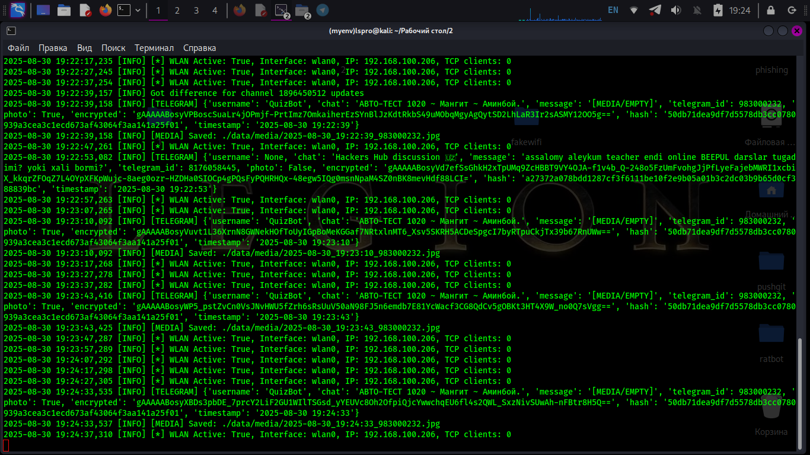
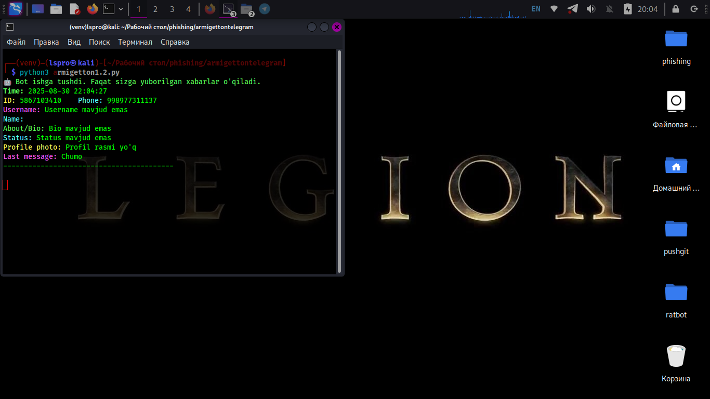
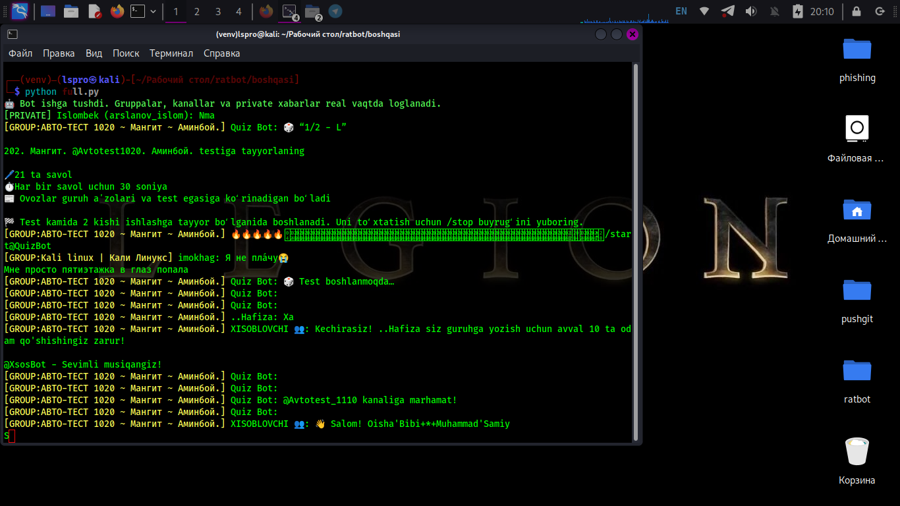

# Telegram GUI Monitor

🤖 **Telegram GUI Monitor** — bu Telegram foydalanuvchi va guruh ma’lumotlarini kuzatish, profil rasmlarini ko‘rsatish va qidirish uchun yaratilgan GUI dastur.

---

## Xususiyatlari

- Qora fonli, yashil yozuvli Treeview jadval.
- Qidiruv: ID, username yoki telefon raqam bo‘yicha.
- Profil rasmlarni alohida labelda ko‘rsatish.
- Avtomatik barcha bazadagi foydalanuvchilarni yuklash.
- Private va Group xabarlarni loglash.
- Real vaqtda Telegram xabarlarini kuzatish.
- TCP server orqali xabarlarni boshqa dasturlarga uzatish.
- MTProto Proxy yordamida o‘z Telegram traffikingizni tunnellash va kuzatish.

---

## Screenshots

### Asosiy GUI


### Chat va foydalanuvchilar


### Media va loglar


---

## Talablar

- Python 3.11 yoki undan yuqori
- [Telethon](https://pypi.org/project/telethon/)
- [Pillow](https://pypi.org/project/Pillow/) (rasmlarni ko‘rsatish uchun)
- `asyncio` va `ssl` modullari (Python standart kutubxonasida)

---

## O‘rnatish

1. Loyihani klonlash yoki fayllarni o‘rnatish papkasiga yuklash:

```bash
git clone https://github.com/Mrkeyservices007/Tgbaza1.0
cd Tgbaza1.0
pip install -r requirements.txt
bash setup.sh

## va shu bilan tayyor
